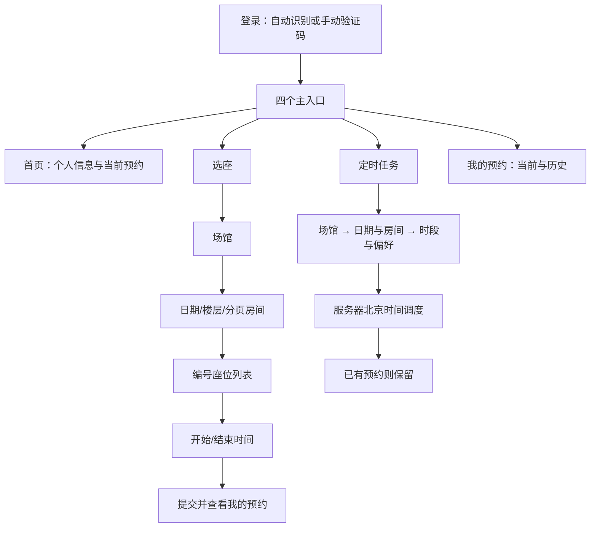

# 功能结构与实现优化报告

日期：2026-10-07。范围：当前工作区 libseatbook-1.1.0 客户端和配套 Python 服务源码。此次在该目录落实修改；旧 Downloads / C:\\lsb 副本及线上服务未同步。当前目录没有 Git 仓库，未创建提交或 PR。

## 1. 功能结构判断

现有功能能够覆盖“登录、选座、预约、查询、取消、定时执行”的主流程。主要问题集中在状态管理与可靠性：页面把网络失败当空数据，登录恢复与页面导航分散，旧请求能覆盖新筛选，定时服务对账号、已有预约和存储并发缺少边界。

调整后的入口为“首页 / 选座 / 定时 / 我的预约”。定时任务作为独立常用入口；首页聚焦当前安排，选座聚焦即时预约，定时聚焦重复安排，我的预约聚焦真实预约结果。



座位网格仍按编号排列，未实现真实空间布局；界面已明确这一点，避免产生位置误解。原 README 声称签到信息，但源码没有签到操作，此次没有补造不存在的学校接口。

## 2. 已确认问题与修改

| 范围 | 原实现问题 | 已落实优化 |
|---|---|---|
| 登录过期 | 仅识别字符串 20003；重登后的任意 status:false 都登出 | 兼容数字/字符串；只对再次过期登出，普通业务错误保留会话 |
| 并发登录 | 重登与迟到响应可能在退出后写回 token | 会话版本、共享重登 Promise、串行存储、写入版本校验 |
| 过期导航 | 多页面重复弹窗；恢复失败没有统一导航 | 根导航统一重置，监听可取消订阅；页面不重复提示过期 |
| 登录交互 | 没有主动手动入口；密码 defaultValue 与异步缓存不一致；失败验证码可能过时 | 可直接切换手动、受控密码输入、验证码请求版本隔离、成功立即重置导航 |
| 网络 | 多数 fetch 无时限、不检查 HTTP/JSON；业务异常信息不一致 | 共享有时限请求，区分 HTTP/JSON/网络/超时/业务错误；传输失败不自动重试预约 |
| OCR | 服务异常后仍可能反复等待多轮 | 自动流程总时限 25 秒；服务/网络异常尽快转手动；算式需完整匹配，支持大写 X |
| 首页 | 个人信息仅用登录缓存，接口失败被吞掉，UTC 日期可能错一天 | 刷新真实个人信息、并行获取数据、区分失败和空态；今日摘要使用本地日期工具 |
| 预约记录 | 重复记录键、手拼分组、空态“去预约”转首页 | SectionList 分组与去重，共享预约卡片，直接进入选座 |
| 房间/时段 | 快速换日期楼层或开始时间时旧响应覆盖；房间只有前 50 条 | 请求版本隔离，清除失效选择，分页合并，时段局部加载和错误重试 |
| 预约提交 | 状态更新前的连点可能重复发请求 | 即时提交锁，提交中禁用关闭；完成后提供查看预约入口 |
| 定时表单 | 日期格式/真实日期/NaN 时间不校验；旧表单残留；删除切换无 catch | 三步向导、回退/完整重置、日期时间校验、操作锁和错误提示、中英文逗号与偏好去重 |
| 执行结果 | 无界枚举日期，长区间容易拖慢界面 | 最多展示 14 天，优先覆盖今天附近，明确标出显示区间 |
| 调度账号 | 验证码账号硬编码，全部任务共享一个 token | 用任务账号取验证码，按凭据隔离 token |
| 已有预约 | 调度在尝试新预约前取消已有预约 | 保留已有预约，写入明确结果；无法确认当前预约则跳过新预约 |
| 座位选择 | 按响应顺序匹配偏好，不按用户偏好顺序；查询不传任务时段 | 有序匹配偏好；按任务目标开始/结束分钟查询空闲 |
| 存储并发 | 执行结束整份任务覆盖，可能丢失 CRUD 修改/复活删除任务 | 读改写锁、执行互斥、原子替换、重新读取并只合并结果、提交前复查配置 |
| 重试与时区 | 登录最高 200 次、失败任务每分钟重试、依赖主机时区 | 登录 5 次、每日任务 3 次、5 分钟冷却；明确使用 UTC+8 |
| 服务协议 | 无效输入触发内部异常；缺 PATCH CORS；不规范错误返回 | 校验 JSON/日期/分钟/房间/凭据/偏好，限制请求体，400/404/408/409/413/500 响应 |
| 构建 | 直接 Gradle 插件 0.86 与 RN 0.76 不匹配；部分锁文件镜像不可解析 | 移除直接插件，由 RN 使用自身 0.76.9 插件；统一官方 npm 下载地址，保留完整性哈希 |
| Android 配置 | app.json 的明文 HTTP 字段没有生成处理；原生依赖/权限与实现功能不符 | 本地 Manifest 插件生成明文访问配置；移除 5 个无引用依赖和无对应功能权限 |

界面统一使用公共颜色、ScreenHeader、StateView、BookingCard，并按安全区域适配顶部、底部导航和弹层。标题、预约状态、时段与主要动作具有明确层级。场馆与定时页首次/回焦更新数据，首页与预约记录支持下拉刷新。

## 3. 实现结构

- App.js：根导航与四个 Tab；统一过期订阅；SafeAreaProvider。
- api/http.js：传输和响应校验；client.js：学校协议和单次过期恢复；scheduleApi.js：定时服务契约。
- utils/storage.js：会话版本及串行写队列；authManager.js：重登协调和根退出；ocr.js：自动流程边界。
- 公共组件只承担展示；取消预约的操作流程放在共享 hook 中；校验与日期处理集中在 utils。
- 页面保留本地状态，异步请求采用版本检查。当前规模无需额外全局状态库，避免引入无必要迁移。
- Python 服务保留 HTTP API 与 JSON 存储，加入单进程可靠性保障；暂未引入数据库或任务队列。

React Navigation 的嵌套导航和重置行为参考[官方导航文档](https://reactnavigation.org/docs/navigation-object/)。预约列表分组采用[React Native SectionList](https://reactnative.dev/docs/sectionlist)。Expo 52 与 React Native 0.76 的对应关系见[官方 SDK 52 发布说明](https://expo.dev/changelog/2024-11-12-sdk-52)。

## 4. 验证证据

- JavaScript：26 项通过，包含网络/认证 15 项、真实 React 组件 8 项、日期与输入 3 项。
- Python：56 项通过，包含调度、学校请求、OCR 边界与真实回环 HTTP；此次发布也在服务器执行同一套回归。
- 源码校验：23 个 JS/JSX 文件解析、本地导入/导出、锁文件依赖与图标资源检查通过。
- Expo Web 导出通过；Android Hermes 字节码导出通过。字节码不是 APK，不证明原生网络或设备交互已经通过。
- Android Expo config introspection 已验证 Manifest 生成处理，包括明文 HTTP，以及无用权限的缺省移除或 tools:node="remove" 标记；此次 1.0.1 APK 的最终合并 Manifest 已验证，明文 HTTP 生效，上述无用权限未出现。
- 内置浏览器在 390px 手机 iframe 中查看首页、场馆、房间、座位时段弹层、三步定时表单及分组预约页；发现并修正底部导航文字裁切。截图保存在 outputs/screenshots。浏览器工具日志还记录过一条 MutationObserver 参数错误；最终应用 bundle 中无此引用，当前页面和上述交互正常，该日志来源未确定。
- 上述登录、学校、OCR 和预约请求均使用 mocks；离线预览注入模拟数据并拦截业务请求，没有提交真实预约。

```powershell
npm run check:source
npm run check:android
npm test
python -m unittest discover -s tests -p "test_*.py"
npm run export:web
npm run export:android
```

## 5. 尚需处理的上线事项

| 优先级 | 事项 | 所需后续工作 |
|---|---|---|
| P0 | 定时 API 无认证及任务归属权限；可读/操作所有任务 | 服务端建立身份验证和按账号授权，客户端配合协议迁移。单独做客户端过滤无法解决访问控制 |
| P0 | 凭据存于 AsyncStorage；OCR/任务使用 HTTP；既有 AES 为可逆协议加密 | 使用设备安全存储并迁移旧数据，部署 HTTPS，建立服务端凭据管理。此次保持现有协议兼容，尚未完成 |
| P1 | 手动执行 HTTP 可能比客户端 15 秒时限更长 | 改为后台执行 ID + 状态查询；超时后先核对结果，不能据此断言服务器未执行 |
| P1 | 存储锁只对同一进程生效 | 多进程部署前改数据库事务/文件跨进程锁与任务队列；引入请求幂等键 |
| P1 | 每日重试次数/冷却可能错过后续释放座位 | 以真实学校放座时间与失败类型制定重试策略；目前有限重试是避免失控请求的保守实现 |
| P1 | 真实学校字段/开放日期和时段未联调 | 真机测试登录、过期恢复、实际可预约时间、预约/取消以及定时查询；客户端日期仍基于设备本地时区 |
| P2 | 网格不是空间地图；无签到、暂离与离场功能 | 有真实接口和布局数据后再实现，不能仅凭 UI 推断学校协议 |

2026-10-07 已更新生产服务器并生成 1.0.1 arm64 APK，签名、版本、Manifest、架构与字节码检查通过。真实设备的 HTTP 交互、返回键、安全区域及学校业务仍需验证；发布记录见 [1.0.1 发布记录](发布记录-1.0.1.md)，这些检查不代表线上预约成功。

